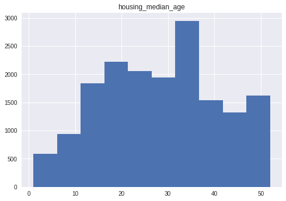
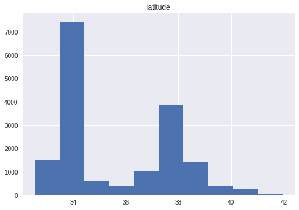

#### Copyright 2017 Google LLC.


```python
# Licensed under the Apache License, Version 2.0 (the "License");
# you may not use this file except in compliance with the License.
# You may obtain a copy of the License at
#
# https://www.apache.org/licenses/LICENSE-2.0
#
# Unless required by applicable law or agreed to in writing, software
# distributed under the License is distributed on an "AS IS" BASIS,
# WITHOUT WARRANTIES OR CONDITIONS OF ANY KIND, either express or implied.
# See the License for the specific language governing permissions and
# limitations under the License.
```

 # Pandas 简介

**学习目标：**
  * 大致了解 *pandas* 库的 `DataFrame` 和 `Series` 数据结构
  * 存取和处理 `DataFrame` 和 `Series` 中的数据
  * 将 CSV 数据导入 pandas 库的 `DataFrame`
  * 对 `DataFrame` 重建索引来随机打乱数据

 [*pandas*](http://pandas.pydata.org/) 是一种列存数据分析 API。它是用于处理和分析输入数据的强大工具，很多机器学习框架都支持将 *pandas* 数据结构作为输入。
虽然全方位介绍 *pandas* API 会占据很长篇幅，但它的核心概念非常简单，我们会在下文中进行说明。有关更完整的参考，请访问 [*pandas* 文档网站](http://pandas.pydata.org/pandas-docs/stable/index.html)，其中包含丰富的文档和教程资源。

 ## 基本概念

以下行导入了 *pandas* API 并输出了相应的 API 版本：


```python
import pandas as pd
pd.__version__
```


    u'0.22.0'


 *pandas* 中的主要数据结构被实现为以下两类：

  * **`DataFrame`**，您可以将它想象成一个关系型数据表格，其中包含多个行和已命名的列。
  * **`Series`**，它是单一列。`DataFrame` 中包含一个或多个 `Series`，每个 `Series` 均有一个名称。

数据框架是用于数据操控的一种常用抽象实现形式。[Spark](https://spark.apache.org/) 和 [R](https://www.r-project.org/about.html) 中也有类似的实现。

 创建 `Series` 的一种方法是构建 `Series` 对象。例如：


```python
 pd.Series(['San Francisco', 'San Jose', 'Sacramento'])

```


    0    San Francisco
    1         San Jose
    2       Sacramento
    dtype: object


```python
# 练习
pd.Series(['Mayi Si','Cao Cao','Liang Zhuge'])
```


    0        Mayi Si
    1        Cao Cao
    2    Liang Zhuge
    dtype: object


 您可以将映射 `string` 列名称的 `dict` 传递到它们各自的 `Series`，从而创建`DataFrame`对象。如果 `Series` 在长度上不一致，系统会用特殊的 [NA/NaN](http://pandas.pydata.org/pandas-docs/stable/missing_data.html) 值填充缺失的值。例如：


```python
city_names = pd.Series(['San Francisco', 'San Jose', 'Sacramento'])
population = pd.Series([852469, 1015785, 485199]) # 对应城市人口

pd.DataFrame({ 'City name': city_names, 'Population': population })


```


<div>
<style scoped>
    .dataframe tbody tr th:only-of-type {
        vertical-align: middle;
    }

    .dataframe tbody tr th {
        vertical-align: top;
    }

    .dataframe thead th {
        text-align: right;
    }
</style>
<table border="1" class="dataframe">
  <thead>
    <tr style="text-align: right;">
      <th></th>
      <th>City name</th>
      <th>Population</th>
    </tr>
  </thead>
  <tbody>
    <tr>
      <th>0</th>
      <td>San Francisco</td>
      <td>852469</td>
    </tr>
    <tr>
      <th>1</th>
      <td>San Jose</td>
      <td>1015785</td>
    </tr>
    <tr>
      <th>2</th>
      <td>Sacramento</td>
      <td>485199</td>
    </tr>
  </tbody>
</table>
</div>


```python
# 练习
hero_names = pd.Series(['Mayi Si','Cao Cao','Liang Zhuge'])
smart_level = pd.Series([9, 7, 8]) 

pd.DataFrame({'Hero name': hero_names, 'Smart level': smart_level})
```


<div>
<style scoped>
    .dataframe tbody tr th:only-of-type {
        vertical-align: middle;
    }

    .dataframe tbody tr th {
        vertical-align: top;
    }

    .dataframe thead th {
        text-align: right;
    }
</style>
<table border="1" class="dataframe">
  <thead>
    <tr style="text-align: right;">
      <th></th>
      <th>Hero name</th>
      <th>Smart level</th>
    </tr>
  </thead>
  <tbody>
    <tr>
      <th>0</th>
      <td>Mayi Si</td>
      <td>9</td>
    </tr>
    <tr>
      <th>1</th>
      <td>Cao Cao</td>
      <td>7</td>
    </tr>
    <tr>
      <th>2</th>
      <td>Liang Zhuge</td>
      <td>8</td>
    </tr>
  </tbody>
</table>
</div>


 但是在大多数情况下，您需要将整个文件加载到 `DataFrame` 中。下面的示例加载了一个包含加利福尼亚州住房数据的文件。请运行以下单元格以加载数据，并创建特征定义：


```python
california_housing_dataframe = pd.read_csv("https://storage.googleapis.com/ml_universities/california_housing_train.csv", sep=",")
california_housing_dataframe.describe()

```


<div>
<style scoped>
    .dataframe tbody tr th:only-of-type {
        vertical-align: middle;
    }

    .dataframe tbody tr th {
        vertical-align: top;
    }

    .dataframe thead th {
        text-align: right;
    }
</style>
<table border="1" class="dataframe">
  <thead>
    <tr style="text-align: right;">
      <th></th>
      <th>longitude</th>
      <th>latitude</th>
      <th>housing_median_age</th>
      <th>total_rooms</th>
      <th>total_bedrooms</th>
      <th>population</th>
      <th>households</th>
      <th>median_income</th>
      <th>median_house_value</th>
    </tr>
  </thead>
  <tbody>
    <tr>
      <th>count</th>
      <td>17000.000000</td>
      <td>17000.000000</td>
      <td>17000.000000</td>
      <td>17000.000000</td>
      <td>17000.000000</td>
      <td>17000.000000</td>
      <td>17000.000000</td>
      <td>17000.000000</td>
      <td>17000.000000</td>
    </tr>
    <tr>
      <th>mean</th>
      <td>-119.562108</td>
      <td>35.625225</td>
      <td>28.589353</td>
      <td>2643.664412</td>
      <td>539.410824</td>
      <td>1429.573941</td>
      <td>501.221941</td>
      <td>3.883578</td>
      <td>207300.912353</td>
    </tr>
    <tr>
      <th>std</th>
      <td>2.005166</td>
      <td>2.137340</td>
      <td>12.586937</td>
      <td>2179.947071</td>
      <td>421.499452</td>
      <td>1147.852959</td>
      <td>384.520841</td>
      <td>1.908157</td>
      <td>115983.764387</td>
    </tr>
    <tr>
      <th>min</th>
      <td>-124.350000</td>
      <td>32.540000</td>
      <td>1.000000</td>
      <td>2.000000</td>
      <td>1.000000</td>
      <td>3.000000</td>
      <td>1.000000</td>
      <td>0.499900</td>
      <td>14999.000000</td>
    </tr>
    <tr>
      <th>25%</th>
      <td>-121.790000</td>
      <td>33.930000</td>
      <td>18.000000</td>
      <td>1462.000000</td>
      <td>297.000000</td>
      <td>790.000000</td>
      <td>282.000000</td>
      <td>2.566375</td>
      <td>119400.000000</td>
    </tr>
    <tr>
      <th>50%</th>
      <td>-118.490000</td>
      <td>34.250000</td>
      <td>29.000000</td>
      <td>2127.000000</td>
      <td>434.000000</td>
      <td>1167.000000</td>
      <td>409.000000</td>
      <td>3.544600</td>
      <td>180400.000000</td>
    </tr>
    <tr>
      <th>75%</th>
      <td>-118.000000</td>
      <td>37.720000</td>
      <td>37.000000</td>
      <td>3151.250000</td>
      <td>648.250000</td>
      <td>1721.000000</td>
      <td>605.250000</td>
      <td>4.767000</td>
      <td>265000.000000</td>
    </tr>
    <tr>
      <th>max</th>
      <td>-114.310000</td>
      <td>41.950000</td>
      <td>52.000000</td>
      <td>37937.000000</td>
      <td>6445.000000</td>
      <td>35682.000000</td>
      <td>6082.000000</td>
      <td>15.000100</td>
      <td>500001.000000</td>
    </tr>
  </tbody>
</table>
</div>


 上面的示例使用 `DataFrame.describe` 来显示关于 `DataFrame` 的有趣统计信息。另一个实用函数是 `DataFrame.head`，它显示 `DataFrame` 的前几个记录：


```python
california_housing_dataframe.head()
```


<div>
<style scoped>
    .dataframe tbody tr th:only-of-type {
        vertical-align: middle;
    }

    .dataframe tbody tr th {
        vertical-align: top;
    }

    .dataframe thead th {
        text-align: right;
    }
</style>
<table border="1" class="dataframe">
  <thead>
    <tr style="text-align: right;">
      <th></th>
      <th>longitude</th>
      <th>latitude</th>
      <th>housing_median_age</th>
      <th>total_rooms</th>
      <th>total_bedrooms</th>
      <th>population</th>
      <th>households</th>
      <th>median_income</th>
      <th>median_house_value</th>
    </tr>
  </thead>
  <tbody>
    <tr>
      <th>0</th>
      <td>-114.31</td>
      <td>34.19</td>
      <td>15.0</td>
      <td>5612.0</td>
      <td>1283.0</td>
      <td>1015.0</td>
      <td>472.0</td>
      <td>1.4936</td>
      <td>66900.0</td>
    </tr>
    <tr>
      <th>1</th>
      <td>-114.47</td>
      <td>34.40</td>
      <td>19.0</td>
      <td>7650.0</td>
      <td>1901.0</td>
      <td>1129.0</td>
      <td>463.0</td>
      <td>1.8200</td>
      <td>80100.0</td>
    </tr>
    <tr>
      <th>2</th>
      <td>-114.56</td>
      <td>33.69</td>
      <td>17.0</td>
      <td>720.0</td>
      <td>174.0</td>
      <td>333.0</td>
      <td>117.0</td>
      <td>1.6509</td>
      <td>85700.0</td>
    </tr>
    <tr>
      <th>3</th>
      <td>-114.57</td>
      <td>33.64</td>
      <td>14.0</td>
      <td>1501.0</td>
      <td>337.0</td>
      <td>515.0</td>
      <td>226.0</td>
      <td>3.1917</td>
      <td>73400.0</td>
    </tr>
    <tr>
      <th>4</th>
      <td>-114.57</td>
      <td>33.57</td>
      <td>20.0</td>
      <td>1454.0</td>
      <td>326.0</td>
      <td>624.0</td>
      <td>262.0</td>
      <td>1.9250</td>
      <td>65500.0</td>
    </tr>
  </tbody>
</table>
</div>


 *pandas* 的另一个强大功能是**绘制图表**。例如，借助 `DataFrame.hist`，您可以快速了解一个列中值的分布：


```python
california_housing_dataframe.hist('housing_median_age')
```


    array([[<matplotlib.axes._subplots.AxesSubplot object at 0x7f3924fa0f10>]],
          dtype=object)





```python
california_housing_dataframe.hist('latitude')
```


    array([[<matplotlib.axes._subplots.AxesSubplot object at 0x7f3922b32b50>]],
          dtype=object)





 ## 访问数据

您可以使用熟悉的 Python dict/list 指令访问 `DataFrame` 数据：


```python
cities = pd.DataFrame({ 'City name': city_names, 'Population': population })
print type(cities['City name'])
cities['City name']
```

    <class 'pandas.core.series.Series'>
    


    0    San Francisco
    1         San Jose
    2       Sacramento
    Name: City name, dtype: object


```python
heros = pd.DataFrame({'Hero name':hero_names, 'Smart level': smart_level})
print type(heros['Hero name'])
heros['Hero name']
```

    <class 'pandas.core.series.Series'>
    


    0        Mayi Si
    1        Cao Cao
    2    Liang Zhuge
    Name: Hero name, dtype: object


```python
print type(cities['City name'][1])
cities['City name'][1]
```

    <type 'str'>
    


    'San Jose'


```python
print type(heros['Smart level'][2])
heros['Smart level'][2]
```

    <type 'numpy.int64'>
    


    8


```python
print type(cities[0:2])
cities[0:2]
```

    <class 'pandas.core.frame.DataFrame'>
    


<div>
<style scoped>
    .dataframe tbody tr th:only-of-type {
        vertical-align: middle;
    }

    .dataframe tbody tr th {
        vertical-align: top;
    }

    .dataframe thead th {
        text-align: right;
    }
</style>
<table border="1" class="dataframe">
  <thead>
    <tr style="text-align: right;">
      <th></th>
      <th>City name</th>
      <th>Population</th>
    </tr>
  </thead>
  <tbody>
    <tr>
      <th>0</th>
      <td>San Francisco</td>
      <td>852469</td>
    </tr>
    <tr>
      <th>1</th>
      <td>San Jose</td>
      <td>1015785</td>
    </tr>
  </tbody>
</table>
</div>


```python
print type(heros[0:2])
heros[0:1]
```

    <class 'pandas.core.frame.DataFrame'>
    


<div>
<style scoped>
    .dataframe tbody tr th:only-of-type {
        vertical-align: middle;
    }

    .dataframe tbody tr th {
        vertical-align: top;
    }

    .dataframe thead th {
        text-align: right;
    }
</style>
<table border="1" class="dataframe">
  <thead>
    <tr style="text-align: right;">
      <th></th>
      <th>Hero name</th>
      <th>Smart level</th>
    </tr>
  </thead>
  <tbody>
    <tr>
      <th>0</th>
      <td>Mayi Si</td>
      <td>9</td>
    </tr>
  </tbody>
</table>
</div>


 此外，*pandas* 针对高级[索引和选择](http://pandas.pydata.org/pandas-docs/stable/indexing.html)提供了极其丰富的 API（数量过多，此处无法逐一列出）。

 ## 操控数据

您可以向 `Series` 应用 Python 的基本运算指令。例如：


```python
population / 1000.
```


    0     852.469
    1    1015.785
    2     485.199
    dtype: float64


 [NumPy](http://www.numpy.org/) 是一种用于进行科学计算的常用工具包。*pandas* `Series` 可用作大多数 NumPy 函数的参数：


```python
import numpy as np

np.log(population)
```


    0    13.655892
    1    13.831172
    2    13.092314
    dtype: float64


```python
import numpy as np

np.log(smart_level)
```


    0    2.197225
    1    1.945910
    2    2.079442
    dtype: float64


 对于更复杂的单列转换，您可以使用 `Series.apply`。像 Python [映射函数](https://docs.python.org/2/library/functions.html#map)一样，`Series.apply` 将以参数形式接受 [lambda 函数](https://docs.python.org/2/tutorial/controlflow.html#lambda-expressions)，而该函数会应用于每个值。

下面的示例创建了一个指明 `population` 是否超过 100 万的新 `Series`：


```python
population.apply(lambda val: val > 1000000)
```


    0    False
    1     True
    2    False
    dtype: bool


```python
# 他们三个人的聪明水平是否超过 7
smart_level.apply(lambda val: val >7)
```


    0     True
    1    False
    2     True
    dtype: bool


 
`DataFrames` 的修改方式也非常简单。例如，以下代码向现有 `DataFrame` 添加了两个 `Series`：


```python
cities['Area square miles'] = pd.Series([46.87, 176.53, 97.92])
cities['Population density'] = cities['Population'] / cities['Area square miles']
cities
```


<div>
<style scoped>
    .dataframe tbody tr th:only-of-type {
        vertical-align: middle;
    }

    .dataframe tbody tr th {
        vertical-align: top;
    }

    .dataframe thead th {
        text-align: right;
    }
</style>
<table border="1" class="dataframe">
  <thead>
    <tr style="text-align: right;">
      <th></th>
      <th>City name</th>
      <th>Population</th>
      <th>Area square miles</th>
      <th>Population density</th>
    </tr>
  </thead>
  <tbody>
    <tr>
      <th>0</th>
      <td>San Francisco</td>
      <td>852469</td>
      <td>46.87</td>
      <td>18187.945381</td>
    </tr>
    <tr>
      <th>1</th>
      <td>San Jose</td>
      <td>1015785</td>
      <td>176.53</td>
      <td>5754.177760</td>
    </tr>
    <tr>
      <th>2</th>
      <td>Sacramento</td>
      <td>485199</td>
      <td>97.92</td>
      <td>4955.055147</td>
    </tr>
  </tbody>
</table>
</div>


```python
heros['Number'] = pd.Series([99, 88, 90])
heros['Hair'] = heros['Number'] * heros['Smart level']
heros

```


<div>
<style scoped>
    .dataframe tbody tr th:only-of-type {
        vertical-align: middle;
    }

    .dataframe tbody tr th {
        vertical-align: top;
    }

    .dataframe thead th {
        text-align: right;
    }
</style>
<table border="1" class="dataframe">
  <thead>
    <tr style="text-align: right;">
      <th></th>
      <th>Hero name</th>
      <th>Smart level</th>
      <th>Number</th>
      <th>Hair</th>
    </tr>
  </thead>
  <tbody>
    <tr>
      <th>0</th>
      <td>Mayi Si</td>
      <td>9</td>
      <td>99</td>
      <td>891</td>
    </tr>
    <tr>
      <th>1</th>
      <td>Cao Cao</td>
      <td>7</td>
      <td>88</td>
      <td>616</td>
    </tr>
    <tr>
      <th>2</th>
      <td>Liang Zhuge</td>
      <td>8</td>
      <td>90</td>
      <td>720</td>
    </tr>
  </tbody>
</table>
</div>


 ## 练习 1

通过添加一个新的布尔值列（当且仅当以下*两项*均为 True 时为 True）修改 `cities` 表格：

  * 城市以圣人命名。
  * 城市面积大于 50 平方英里。

**注意：**布尔值 `Series` 是使用“按位”而非传统布尔值“运算符”组合的。例如，执行*逻辑与*时，应使用 `&`，而不是 `and`。

**提示：**"San" 在西班牙语中意为 "saint"。


```python
# Your code here

cities['Analyze'] = cities['City name'].apply(lambda name:name.startswith('San')) & (cities['Area square miles'] > 50)
cities
```


<div>
<style scoped>
    .dataframe tbody tr th:only-of-type {
        vertical-align: middle;
    }

    .dataframe tbody tr th {
        vertical-align: top;
    }

    .dataframe thead th {
        text-align: right;
    }
</style>
<table border="1" class="dataframe">
  <thead>
    <tr style="text-align: right;">
      <th></th>
      <th>City name</th>
      <th>Population</th>
      <th>Area square miles</th>
      <th>Population density</th>
      <th>Is wide and has saint name</th>
      <th>Analyze</th>
    </tr>
  </thead>
  <tbody>
    <tr>
      <th>0</th>
      <td>San Francisco</td>
      <td>852469</td>
      <td>46.87</td>
      <td>18187.945381</td>
      <td>False</td>
      <td>False</td>
    </tr>
    <tr>
      <th>1</th>
      <td>San Jose</td>
      <td>1015785</td>
      <td>176.53</td>
      <td>5754.177760</td>
      <td>True</td>
      <td>True</td>
    </tr>
    <tr>
      <th>2</th>
      <td>Sacramento</td>
      <td>485199</td>
      <td>97.92</td>
      <td>4955.055147</td>
      <td>False</td>
      <td>False</td>
    </tr>
  </tbody>
</table>
</div>


 ### 解决方案

点击下方，查看解决方案。


```python
cities['Is wide and has saint name'] = (cities['Area square miles'] > 50) & cities['City name'].apply(lambda name: name.startswith('San'))
cities
```


<div>
<style scoped>
    .dataframe tbody tr th:only-of-type {
        vertical-align: middle;
    }

    .dataframe tbody tr th {
        vertical-align: top;
    }

    .dataframe thead th {
        text-align: right;
    }
</style>
<table border="1" class="dataframe">
  <thead>
    <tr style="text-align: right;">
      <th></th>
      <th>City name</th>
      <th>Population</th>
      <th>Area square miles</th>
      <th>Population density</th>
      <th>Is wide and has saint name</th>
    </tr>
  </thead>
  <tbody>
    <tr>
      <th>0</th>
      <td>San Francisco</td>
      <td>852469</td>
      <td>46.87</td>
      <td>18187.945381</td>
      <td>False</td>
    </tr>
    <tr>
      <th>1</th>
      <td>San Jose</td>
      <td>1015785</td>
      <td>176.53</td>
      <td>5754.177760</td>
      <td>True</td>
    </tr>
    <tr>
      <th>2</th>
      <td>Sacramento</td>
      <td>485199</td>
      <td>97.92</td>
      <td>4955.055147</td>
      <td>False</td>
    </tr>
  </tbody>
</table>
</div>


 ## 索引
`Series` 和 `DataFrame` 对象也定义了 `index` 属性，该属性会向每个 `Series` 项或 `DataFrame` 行赋一个标识符值。

默认情况下，在构造时，*pandas* 会赋可反映源数据顺序的索引值。索引值在创建后是稳定的；也就是说，它们不会因为数据重新排序而发生改变。


```python
city_names.index
```


    RangeIndex(start=0, stop=3, step=1)


```python
cities.index
```


    RangeIndex(start=0, stop=3, step=1)


 调用 `DataFrame.reindex` 以手动重新排列各行的顺序。例如，以下方式与按城市名称排序具有相同的效果：


```python
cities.reindex([2, 1, 0])
```


<div>
<style scoped>
    .dataframe tbody tr th:only-of-type {
        vertical-align: middle;
    }

    .dataframe tbody tr th {
        vertical-align: top;
    }

    .dataframe thead th {
        text-align: right;
    }
</style>
<table border="1" class="dataframe">
  <thead>
    <tr style="text-align: right;">
      <th></th>
      <th>City name</th>
      <th>Population</th>
      <th>Area square miles</th>
      <th>Population density</th>
      <th>Is wide and has saint name</th>
      <th>Analyze</th>
    </tr>
  </thead>
  <tbody>
    <tr>
      <th>2</th>
      <td>Sacramento</td>
      <td>485199</td>
      <td>97.92</td>
      <td>4955.055147</td>
      <td>False</td>
      <td>False</td>
    </tr>
    <tr>
      <th>1</th>
      <td>San Jose</td>
      <td>1015785</td>
      <td>176.53</td>
      <td>5754.177760</td>
      <td>True</td>
      <td>True</td>
    </tr>
    <tr>
      <th>0</th>
      <td>San Francisco</td>
      <td>852469</td>
      <td>46.87</td>
      <td>18187.945381</td>
      <td>False</td>
      <td>False</td>
    </tr>
  </tbody>
</table>
</div>


 重建索引是一种随机排列 `DataFrame` 的绝佳方式。在下面的示例中，我们会取用类似数组的索引，然后将其传递至 NumPy 的 `random.permutation` 函数，该函数会随机排列其值的位置。如果使用此重新随机排列的数组调用 `reindex`，会导致 `DataFrame` 行以同样的方式随机排列。
尝试多次运行以下单元格！


```python
cities.reindex(np.random.permutation(cities.index))
```


<div>
<style scoped>
    .dataframe tbody tr th:only-of-type {
        vertical-align: middle;
    }

    .dataframe tbody tr th {
        vertical-align: top;
    }

    .dataframe thead th {
        text-align: right;
    }
</style>
<table border="1" class="dataframe">
  <thead>
    <tr style="text-align: right;">
      <th></th>
      <th>City name</th>
      <th>Population</th>
      <th>Area square miles</th>
      <th>Population density</th>
      <th>Is wide and has saint name</th>
      <th>Analyze</th>
    </tr>
  </thead>
  <tbody>
    <tr>
      <th>0</th>
      <td>San Francisco</td>
      <td>852469</td>
      <td>46.87</td>
      <td>18187.945381</td>
      <td>False</td>
      <td>False</td>
    </tr>
    <tr>
      <th>2</th>
      <td>Sacramento</td>
      <td>485199</td>
      <td>97.92</td>
      <td>4955.055147</td>
      <td>False</td>
      <td>False</td>
    </tr>
    <tr>
      <th>1</th>
      <td>San Jose</td>
      <td>1015785</td>
      <td>176.53</td>
      <td>5754.177760</td>
      <td>True</td>
      <td>True</td>
    </tr>
  </tbody>
</table>
</div>


 有关详情，请参阅[索引文档](http://pandas.pydata.org/pandas-docs/stable/indexing.html#index-objects)。

 ## 练习 2

`reindex` 方法允许使用未包含在原始 `DataFrame` 索引值中的索引值。请试一下，看看如果使用此类值会发生什么！您认为允许此类值的原因是什么？


```python
# Your code here
cities.reindex([4, 0 ,3, 2, 1])
```


<div>
<style scoped>
    .dataframe tbody tr th:only-of-type {
        vertical-align: middle;
    }

    .dataframe tbody tr th {
        vertical-align: top;
    }

    .dataframe thead th {
        text-align: right;
    }
</style>
<table border="1" class="dataframe">
  <thead>
    <tr style="text-align: right;">
      <th></th>
      <th>City name</th>
      <th>Population</th>
      <th>Area square miles</th>
      <th>Population density</th>
      <th>Is wide and has saint name</th>
      <th>Analyze</th>
    </tr>
  </thead>
  <tbody>
    <tr>
      <th>4</th>
      <td>NaN</td>
      <td>NaN</td>
      <td>NaN</td>
      <td>NaN</td>
      <td>NaN</td>
      <td>NaN</td>
    </tr>
    <tr>
      <th>0</th>
      <td>San Francisco</td>
      <td>852469.0</td>
      <td>46.87</td>
      <td>18187.945381</td>
      <td>False</td>
      <td>False</td>
    </tr>
    <tr>
      <th>3</th>
      <td>NaN</td>
      <td>NaN</td>
      <td>NaN</td>
      <td>NaN</td>
      <td>NaN</td>
      <td>NaN</td>
    </tr>
    <tr>
      <th>2</th>
      <td>Sacramento</td>
      <td>485199.0</td>
      <td>97.92</td>
      <td>4955.055147</td>
      <td>False</td>
      <td>False</td>
    </tr>
    <tr>
      <th>1</th>
      <td>San Jose</td>
      <td>1015785.0</td>
      <td>176.53</td>
      <td>5754.177760</td>
      <td>True</td>
      <td>True</td>
    </tr>
  </tbody>
</table>
</div>


 ### 解决方案

点击下方，查看解决方案。

 如果您的 `reindex` 输入数组包含原始 `DataFrame` 索引值中没有的值，`reindex` 会为此类“丢失的”索引添加新行，并在所有对应列中填充 `NaN` 值：


```python
cities.reindex([0, 4, 5, 2])
```


<div>
<style scoped>
    .dataframe tbody tr th:only-of-type {
        vertical-align: middle;
    }

    .dataframe tbody tr th {
        vertical-align: top;
    }

    .dataframe thead th {
        text-align: right;
    }
</style>
<table border="1" class="dataframe">
  <thead>
    <tr style="text-align: right;">
      <th></th>
      <th>City name</th>
      <th>Population</th>
      <th>Area square miles</th>
      <th>Population density</th>
      <th>Is wide and has saint name</th>
    </tr>
  </thead>
  <tbody>
    <tr>
      <th>0</th>
      <td>San Francisco</td>
      <td>852469.0</td>
      <td>46.87</td>
      <td>18187.945381</td>
      <td>False</td>
    </tr>
    <tr>
      <th>4</th>
      <td>NaN</td>
      <td>NaN</td>
      <td>NaN</td>
      <td>NaN</td>
      <td>NaN</td>
    </tr>
    <tr>
      <th>5</th>
      <td>NaN</td>
      <td>NaN</td>
      <td>NaN</td>
      <td>NaN</td>
      <td>NaN</td>
    </tr>
    <tr>
      <th>2</th>
      <td>Sacramento</td>
      <td>485199.0</td>
      <td>97.92</td>
      <td>4955.055147</td>
      <td>False</td>
    </tr>
  </tbody>
</table>
</div>


 这种行为是可取的，因为索引通常是从实际数据中提取的字符串（请参阅 [*pandas* reindex 文档](http://pandas.pydata.org/pandas-docs/stable/generated/pandas.DataFrame.reindex.html)，查看索引值是浏览器名称的示例）。

在这种情况下，如果允许出现“丢失的”索引，您将可以轻松使用外部列表重建索引，因为您不必担心会将输入清理掉。
